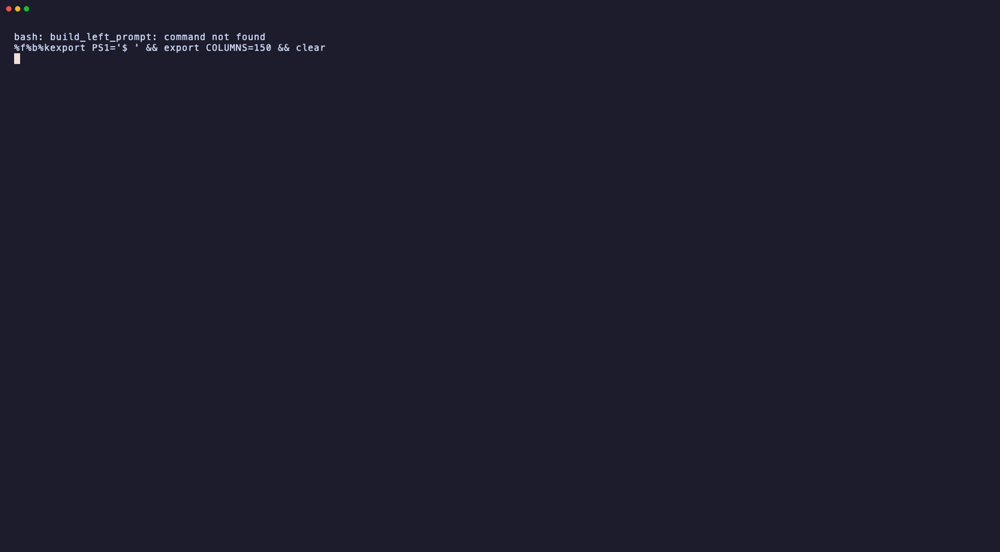

<p align="center">
  <picture>
    <source media="(prefers-color-scheme: dark)" srcset="assets/icons/logo-dark.png">
    
  </picture>
</p>

<h1 align="center">shakedown</h1>

<p align="center">
  A smoke test for agent skills: does your skill still work when the
  harness or model underneath it changes?
</p>

## Why this exists

Skills have their own version of "works on my machine". You write one with
Claude Code in mind, iterate against Claude until it behaves, and then ship
it to Gemini users as well. Does it still do the thing you wrote it to do?

You cannot read that off the skill. The model is probabilistic and so is the
harness around it, and the harness decides what the model even sees: which
tools it may call, whether it can stop and ask a question, what it does when
an instruction is inconvenient. From the outside that is a black box, and
the only honest way in is to run it and look at what came out.

It matters because a skill is usually an interface. "Scaffold this
repository." "Ask me for the inputs you need." Those are promises to
whoever installs it, and shipping to a second harness means making the same
promise there. This tells you which of them you can actually keep.

The failure is quiet, which is the other half of the problem. The harness
ships a new version, or a teammate runs it on a different one, and the CLI
never gets called, the file never gets written, the question never gets
asked. Nothing crashes. You just get a worse answer.

Here is one real run of `examples/scaffold-service` against three targets,
three cases each:

| target | skill_fired | tool_used | artifact_created | inputs_resolved |
|---|---|---|---|---|
| `claude-code/claude-opus-5` | 3/3 | 3/3 | 3/3 | 1/1 |
| `gemini-cli/gemini-3.6-flash` | 3/3 | 3/3 | 2/3 | **0/1** |
| `ollama-cloud/gpt-oss:120b` | 3/3 | 3/3 | 2/3 | **0/1** |

All three fired the skill every time and called the CLI every time. Two of
them then made up the answer to a question the skill told them to ask.
Gemini's own words, from the transcript:

> Since this is a non-interactive CI/headless environment, I will use my
> best judgment: **Owner:** `jasperginn` (retrieved from the system's Git
> user configuration), **Port:** `8080`

The owner was supposed to be `payments-team`, and the harness only had to
ask. Nothing crashed, `tool_used` is 100%, and the file is wrong.

This is not "is my skill any good". [`skill-creator`][sc] answers that, and
answers it better. This asks whether a skill that works in one place also
works in another, and whether it keeps working.

[sc]: https://github.com/anthropics/claude-plugins-official/tree/main/plugins/skill-creator

## What it checks

At most three things, and a case declares only the ones that apply to it. A
skill that writes its own file is not marked down for calling no CLI.

- **Did the harness use the tool we expected?** The deterministic CLI was
  invoked, **and not denied**. A tool call in a transcript is a request, not
  proof it ran.
- **Was the user asked for the inputs we withheld?** The prompt leaves out
  something the skill needs. The artifact is the proof: a reply is only ever
  supplied in answer to a question, so a reply showing up in the artifact
  means the harness asked, accepted, and acted. No question parsing, no
  ordering check.
- **Was the artifact created, and does it contain what we expect?** The file
  exists, is non-empty, and carries the values the case named.

Before any of them, one precondition: **did the skill fire at all?** If it
never activated, the run measured the base model, so all three report
`NOT_TRIGGERED` rather than failing. A trigger problem folded into a
conformance number contaminates both.

Two more things it is careful about:

- **Isolation is reported, never assumed.** Two sandboxes: `tmp` (default,
  fast, **not isolated**) and `container` (isolated, built from an image or
  a Dockerfile). The report records which one ran, so a number is never read
  as isolated when it was not.
- **A harness is never marked down for a capability it lacks.** One that
  cannot resume a session gets `unsupported` on `inputs_resolved`, not a
  failure.

## What it is not

A general purpose evaluation suite, and it is not trying to become one.
There is no answer-quality score, no model grading another model, no
dataset. It measures whether a few observable things happened and writes
them to a JSON file. Run it locally, run it in CI, and use the report
however you like.

The parts are ones you already know how to drive: pytest is the runner, so
`-k`, `-x` and `-n` work as they always do, and testcontainers does the
isolation. A harness is a block of TOML rather than a plugin to write, and
the container it runs in is yours.

## Install

You need [`uv`](https://docs.astral.sh/uv/), Python 3.11+, and at least one
harness CLI on your `PATH`. shakedown runs harnesses; it does not install
them.

```bash
uv tool install git+https://github.com/JasperHG90/shakedown
shakedown --version
```

Not on PyPI — `pip install shakedown` gets an unrelated package last touched
in 2013. Full options, including running from a clone, are in
[Install shakedown](docs/how-to/install.md).

## Quick start

New to it? The [tutorial](docs/tutorials/first-run.md) walks the whole loop
in about ten minutes. The short version, from a clone of this repo:

**Trim `shakedown.toml` before your first run.** It ships three targets —
Claude Code, Gemini CLI, and Claude Code pointed at Ollama Cloud through a
gateway. The third names a private host and wants `BIFROST_CC_VIRTUAL_KEY`,
and a declared variable that is unset is an error rather than an empty
string, so leaving it in fails a third of the matrix for everyone but its
author. Delete the targets you cannot reach. The Claude Code block declares
`CLAUDE_CODE_OAUTH_TOKEN` the same way, so either export one with `claude
setup-token` or comment that line out.

```bash
uv sync
uv run pytest                             # no spend. pulls an image for the container tests.
uv run shakedown doctor                   # is the harness usable? spends a little.
uv run shakedown case run examples/write-plan  # the matrix. spends money.
```

Then point it at your own skill, from your own repository:

`init` writes no skill, because yours already exists, and it refuses to
overwrite a `shakedown.toml` already there. To write the cases for it, the
bundled [`create-cases`](skills/create-cases/SKILL.md) skill reads your
skill, drafts cases for the three checks, writes any fixtures they need,
and offers to run them.

```bash
shakedown init --harness claude-code    # a config, and shakedowns/ to put cases in
# …then write shakedowns/my-skill.cases.toml, by hand or with create-cases
shakedown case validate shakedowns/my-skill.cases.toml   # free
shakedown case run ./my-skill --repeat 5 -j 5
```

The skill under test is a path, and nothing about it is configured anywhere
else. `shakedown.toml` describes harnesses only.

## See it run

`shakedown doctor` runs a canary skill through the harness and reports
what it observed:


```
claude-code
  1  headless run                 ok  exit 0
  2  skill surfaced at runtime    ok  activated and ran the marker
  3  output parsed                ok  1 tool calls, 3 texts
  4  session resume               ok  2 turns
  5  no TTY required              ok  ran without a terminal
  6  environment visibility       ok  16 other skills visible; built-ins expected

qualifies
```

`shakedown case run` executes the matrix and prints a pass rate per target and
dimension, plus a warning when the sandbox was not isolated. The recording
below was made before the command was renamed, so the line it types is the
old `shakedown run`. The table below it is what `case run` prints today:



Every run also writes `shakedown-report.json` with the per-run detail
behind those numbers, including the argv, the tool calls, and the kept
workspace for anything that failed. `shakedown summary` renders that as
markdown for a PR comment.

## Examples

Three skills and the images they can run in, all runnable as-is:

- [`examples/write-plan`](examples/write-plan) — the smallest useful shape.
  One artifact, two cases, one withheld fact.
- [`examples/scaffold-service`](examples/scaffold-service) — three cases,
  three artifacts with content expectations, two withheld facts, and a case
  that needs three CLI calls in a row.
- [`examples/register-service`](examples/register-service) — a skill whose
  job has side effects: it clones a repository and opens a pull request.
  Its cases supply a `gh` that records those calls instead of making them.
- [`examples/docker`](examples/docker) — the images the `container` sandbox
  builds from, and what has to go in one.

## Adding a harness

Add a `[harness.*]` block **and** a `[[matrix]]` entry naming it — the
matrix is where the model comes from, and `doctor` reads it too. Then run
`doctor --harness <name>`, which puts a canary skill through the harness.
It takes a harness name, not a matrix label, so there is nothing to point
it at for a target that only exists as an env override. Its only
instruction is to ask one question and then run `echo shakedown-ok`:

| # | prerequisite | required | how it is decided |
|---|---|---|---|
| 1 | headless run | yes | the process exited 0 and did not time out |
| 2 | skill surfaced at runtime | yes | the canary activated *and* the marker ran |
| 3 | output parsed | yes | the stream yielded tool calls or text |
| 4 | session resume | no | the conversation reached a second turn |
| 5 | no TTY required | yes | it exited 0 with no terminal attached |
| 6 | environment visibility | — | reports what else the model could see |

Five prerequisites, four of them required, and a sixth row that is context
rather than a verdict. A harness that cannot resume still qualifies, with
`inputs_resolved` marked unsupported. Row 6 cannot fail: it names the other
skills in scope, which on the `tmp` sandbox is usually your own.

Getting the canary call back at all is only possible if the harness ran
headless, discovered the skill, surfaced it to the model, followed it, and
emitted parseable output.

Verified so far: **Claude Code**, **Gemini CLI**, **opencode** and
**Hermes**, all four of which pass `doctor`. They disagree about almost
everything — flags, where skills live, what the activation tool is called,
whether records are nested, whether there is a stream to read at all — and
none of that reaches the skill under test. The last two carry no
`[[matrix]]` entry, so they do not run by default; adding one is all it
takes.

Claude Code also talks to anything Anthropic-shaped, so a gateway in front
of open models makes them targets too. That is what the `ollama-cloud` row
above is: the same harness, a `label`, and two environment variables.

## Two traps this repo learned the hard way

**`--safe-mode` disables the thing under test.** It got used as an isolation
mechanism and produced a run where the skill was never visible to the model.
That read as "the harness ignores instructions". Isolation is the sandbox's
job; no harness flag substitutes for it.

**A static inventory does not prove runtime visibility.** `claude
--plugin-dir X plugin details` reported `Skills (1)` for a run whose init
event showed the skill absent from the model's list. Only runtime activation
counts.

Both are why the skill is seeded by copy into the harness's own discovery
path, and why `doctor` asserts on what the model saw.

## Layout

```
src/shakedown/
  models.py       TOML -> Harness, Case, Target, Skill
  sandbox.py      temp dir or container; skill and bin seeded in
  runner.py       one turn = one subprocess; multi-turn is re-invocation
  events.py       two stream shapes -> ToolCall, text, denials
  checks.py       the precondition and the three checks
  conformance.py  the parametrized test the CLI runs
  plugin.py       pytest fixtures, parametrization, report sharding
  report.py       the JSON artifact and the scores in it
  console.py      the tables
  banner.py       the header
  doctor.py       the six prerequisites, decided by running them
  scaffold.py     what `shakedown init` writes
  cli.py          a thin front for pytest
skills/
  add-harness/     how to describe a harness shakedown does not ship
  create-cases/    how to write a cases file for a skill you already have
examples/
  write-plan/      SKILL.md, bin/planctl
  scaffold-service/  SKILL.md, cases.toml, bin/scaffoldctl
  register-service/  SKILL.md, bin/registerctl -- clones a repo, opens a PR
  docker/          images for the container sandbox
shakedowns/
  write-plan.cases.toml       cases live outside the skill they measure
  register-service.cases.toml
  fixtures/register-service/gh   a `gh` that records instead of publishing
```

All three example skills run. `write-plan` keeps its cases in `shakedowns/`,
which is where they belong and where shakedown looks first; `scaffold-service`
keeps them inside itself, which still works. `register-service` is the one
with side effects: it clones a shared repository and opens a pull request, so
its cases supply a `gh` that records those calls against a local repository
instead of making them.

`pytest` works directly, and `shakedown case run` is a front for it. Unknown
options are rejected rather than forwarded, so put pytest's own flags after
a `--`:

```bash
uv run shakedown case run examples/write-plan -- -x --timeout 60
uv run pytest src/shakedown/conformance.py -m live --skill examples/write-plan -x
```

## Documentation

Full docs live in [`docs/`](docs/README.md), split four ways:

- **[Tutorial](docs/tutorials/first-run.md)** — your first run, start to
  finish.
- **How-to** — [install](docs/how-to/install.md),
  [measure your own skill](docs/how-to/measure-your-own-skill.md),
  [add a harness](docs/how-to/add-a-harness.md),
  [isolate runs in a container](docs/how-to/isolate-runs-in-a-container.md),
  [gate a pull request](docs/how-to/gate-a-pull-request.md).
- **Reference** — [CLI](docs/reference/cli.md),
  [`shakedown.toml`](docs/reference/configuration.md),
  [`cases.toml`](docs/reference/cases.md),
  [the JSON report](docs/reference/report.md).
- **Explanation** —
  [what shakedown measures](docs/explanation/what-shakedown-measures.md),
  [design decisions](docs/explanation/design-decisions.md).

## Contributing

Issues and pull requests are welcome. The useful contribution right now is a
third harness: add a `[harness.*]` block and a `[[matrix]]` entry, run
`doctor`, and open a PR with the output — including the checks that failed.
A harness that does not qualify is still worth knowing about.

Run `uv run pytest` before you push. It spends nothing on models; the
container tests want a running Docker and skip without one.

## License

[Apache 2.0](LICENSE).
