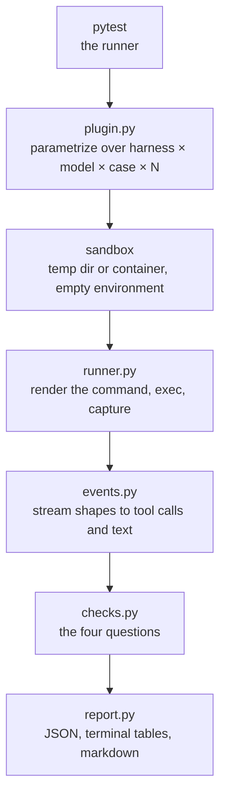

# Design decisions

Why shakedown is shaped the way it is, and what was tried and dropped. Read
this when a piece of the tool surprises you and you want to know whether it
is deliberate.

For what the tool actually checks, read
[What shakedown measures](what-shakedown-measures.md) first.

## The pieces



Config describes harnesses. Harness behaviour lives in the harness. The
framework runs things and asserts on what came back — it holds no opinion
about any particular agent CLI.

## The CLI is a thin front for pytest

`shakedown run` translates friendly flags into pytest arguments and shells
out. It is convenience, never a wall.

Three rules keep it honest:

- **It shells pytest rather than reimplementing it.** `-k`, `-n`, `-x`,
  `--lf`, and every installed plugin keep working.
- **Bare pytest keeps working.** A contributor who reaches for pytest
  directly is not fighting the tool, and CI can use either.
- **Anything the CLI does not model stays reachable**, after a `--`
  separator.

That last point is the one that bites. Click rejects unknown options before
they reach pytest, so `shakedown run ./my-skill --timeout 600` is an error,
not a pass-through. Write `shakedown run ./my-skill -- --timeout 600`.

Parametrizing over the matrix is exactly what pytest's fixtures already do,
and `-n` from pytest-xdist gives parallel runs for free: every scenario is
independent, so workers each write a shard and the controller merges them
into one report.

## The environment is empty by default

A sandbox starts with no environment variables at all, plus exactly what
`[harness.*.env]` declares.

This is the difference between contamination being *structurally impossible*
and being something a flag suppresses. It also makes runs reproducible: two
machines with different shells produce the same environment.

Two rules follow from it:

- **Environment is part of run identity.** A different `ANTHROPIC_BASE_URL`
  is a different provider, so it must appear in the label or you will
  silently average two backends into one number.
- **Values never appear in output.** The TOML holds `${VAR}` references,
  values come from the host at run time, and reports record key names only.

The cost is the thing that catches everyone out exactly once: putting a
secret in your CI settings is only half the job. The harness block has to
ask for it by name, or the harness starts unauthenticated and every run
reports `not_triggered`.

## The sandbox default is a temp directory, not a container

The design called for the container as the default. The shipped default is
`tmp`, and that is a deliberate retreat.

A container needs the harness CLI baked into an image and its credentials
passed as environment variables. A harness authenticated by browser login
keeps its token in the host keychain, where a container cannot see it.
Requiring all that before anything runs would have made the first run the
hardest one.

So the cost is stated instead of hidden. `tmp` runs on the host, the harness
can see whatever else is installed there, every report records
`isolated: false`, and the terminal prints a warning under the table.
`doctor` row 6 tells you how many other skills were in scope.

A container *deletes* rather than hides. Inside one the harness has no host
configuration to leak at all, which removes the need for safe-mode flags,
config-root overrides, and an isolation assertion. It also pins the harness
version as a property of the image rather than a flag someone has to
remember.

## Multi-turn is re-invocation, not a stream

Both known harnesses expose `--session-id` and `--resume`, so a conversation
is a sequence of subprocess calls:

```python
events = run(harness.start, prompt=case.prompt, sid=sid)
for _ in range(TURN_CAP):
    reply = match_answer(assistant_text(events), case.answers)
    if reply is None:
        break
    given.append(reply)
    events = run(harness.resume, reply=reply, sid=sid)
```

Every turn is a plain process, which is uniform across harnesses, needs no
per-harness stdin encoding, and is trivial to test. A predecessor implemented
a bidirectional streaming driver that worked on one harness and was never
exercised against a real stream.

Gemini's `--resume` takes `latest` rather than a UUID, which is safe here
precisely because the sandbox is per-run and holds exactly one session.

The conversation stops after six turns, and each turn is bounded by
`--timeout` rather than the run as a whole. A turn is the unit that actually
hangs.

## One optional descent, not a query language

Tool calls sit at different depths per harness, though both known ones emit
newline-delimited JSON with a `type` discriminator. Key names are trivially
config. Depth and cardinality are not, and expressing them in TOML would
mean shipping a path-query evaluator — at which point the config becomes an
untestable program.

The compromise is one optional container path: descend into this list, if
present. Claude Code sets `container = "message.content"`; Gemini omits it.
Individual keys may be dotted paths, which covers a flat record that still
buries what you need, as opencode's does under `part`.

A harness that fits neither fails loudly at `doctor` step 3 rather than
scoring zero in silence.

Cardinality is not cosmetic. One Claude record can carry several `tool_use`
blocks. A predecessor counted records where it should have counted blocks,
and a question asked *after* the artifact was written scored as though it
came first.

## Rejected

| Idea | Why not |
|---|---|
| `skills = { mode = "flag", flag = "--plugin-dir {dir}" }` | `--plugin-dir` produced a run whose init event showed the skill absent from the model's list. Copying into the directory the harness scans unaided is the only mode observed to work |
| A `[harness.*.tools]` map of `shell`/`write`/`read` to per-harness names | The names already appear in `start` where the harness needs them, and nothing read the map |
| A CLI-written receipt proving the artifact's bytes | Its digest carries no secret, so an agent that chooses to can fabricate it. Same threat model, more work for the skill author |
| A built-in statistical gate | A gate needs counts, not runs, and the report already carries them. Keeping it out preserves the property that shakedown only measures |
| Per-case timeouts | `--timeout` applies per turn, which is the unit that hangs. No case has needed its own |

On that fourth row, the argument for a gate is real and worth knowing: at a
true pass rate of 0.9 with N=5, the chance of 5 out of 5 is 0.59, so 41% of
unregressed runs score 4/5 and fail against a 5/5 baseline. A team switches
that gate off within a week. Anything reading two reports can do better with
a Wilson bound, and does not need this tool to grow a statistics module.

## Out of scope

- **Skill quality.** Trigger rate, description tuning, A/B between skill
  versions. Use `skill-creator`.
- **Isolation mechanics.** The container's job.
- **Model routing.** If a harness fans out to auxiliary models that is its
  business. Pin `--model` and record what it reports.
- **Permissions and approval modes.** A flag in `start`, nothing more.
- **Cost normalization.** Reported if the harness reports it, absent
  otherwise, never inferred. A number in no unit is worse than no number.

## Non-negotiables

Each was learned by being wrong:

- **Refuse rather than guess.** Where the system cannot know something it
  says so and stops.
- **Never fold infrastructure failure into a quality score.** An expired
  credential, a timeout, a model mismatch: none are the skill's fault, and
  none belong in a pass rate.
- **A missing measurement is not a pass.** Zero rows and zero attempts fail
  loudly and distinctly.
- **State limits beside the numbers.** The "not isolated" warning prints
  under the table, not in a footnote nobody reads.

## Prior art

**`skill-creator`** (Anthropic, ships with Claude Code) covers skill
quality: trigger rate, description optimization, blind A/B between skill
versions. It shells `claude -p` only and has no notion of a second harness,
CI, or regression gating.

**promptfoo** covers prompt and model comparison with repeats, thresholds,
and a web viewer. Driving a second harness through it needs a custom
provider, and the results then need translating back out of its schema.

Neither answers the cross-harness question, and shakedown does only that.

## See also

- [Tutorial: your first run](../tutorials/first-run.md)
- [How-to: isolate runs in a container](../how-to/isolate-runs-in-a-container.md)
- [Reference: `shakedown.toml`](../reference/configuration.md)
- [Explanation: what shakedown measures](what-shakedown-measures.md)
