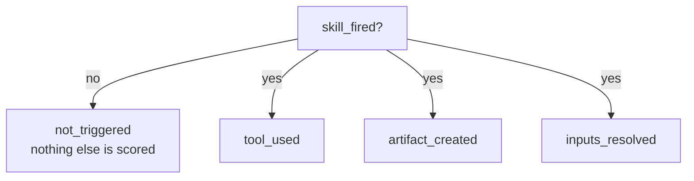

# What shakedown measures

A skill that works on Claude Code is shipped to Gemini users too. Does it
still do the thing you wrote it to do? You cannot read that off the skill.
The model is probabilistic and so is the harness around it, and the harness
decides what the model even sees: which tools it may call, whether it can
stop and ask a question, what it does when an instruction is inconvenient.

The failure is quiet, which is the hard part. The CLI never gets called, the
file never gets written, the question never gets asked. Nothing crashes. You
just get a worse answer.

shakedown runs the skill and looks at what came out.

## Four questions, asked separately

`skill_fired` is a precondition, not a fourth score. If the skill never
activated, the other three measured the bare model, and folding that into a
number would contaminate it. Whether a skill triggers reliably is a real
question, but it is a different one, and
[`skill-creator`](https://github.com/anthropics/claude-plugins-official/tree/main/plugins/skill-creator)
answers it better.

The other three fail independently, so they are scored independently.

**`tool_used`** — the deterministic CLI was invoked, rather than the agent
producing an equivalent-looking result itself. A case names the CLI, not the
harness's tool: `tool = "planctl"` is matched against a call's name *and* its
argument text, so it finds `planctl` inside a `Bash` command on one harness
and inside a `run_shell_command` on another. Matching the tool name itself
would have been a harness-specific check wearing a general name.

**`artifact_created`** — the expected file exists, is non-empty, and carries
the strings the case named. The least interesting of the three, and the only
one that survives a naive implementation.

**`inputs_resolved`** — the prompt deliberately withholds something the skill
needs. The harness has to ask, accept the answer, and use it.

## The artifact is the proof

The third check is where most of the design sits, because the obvious
implementation is wrong.

The obvious implementation reads the transcript: find a question, decide
whether it is about the right topic, check it came before the file was
written. That means parsing questions, tracking topics, and checking
ordering — three fuzzy judgements stacked on each other, each with its own
failure mode.

shakedown does none of it. A reply is supplied *only* in answer to a
question. If `platform-team` shows up inside `PLAN.md`, that string got there
one way: the harness asked, shakedown answered, and the agent used it. That
string exists nowhere else in the run.

So the check is a substring test on a file, and it still cannot be fooled by
ordering. An artifact cannot contain a value that was first revealed on turn
three unless the harness asked on turn two.

A harness that invents a value instead of asking never receives the reply,
so the artifact never contains it, and the check fails. **That failure is the
measurement**, not an error to work around. Here is a real one, from Gemini's
own transcript on the bundled example:

> Since this is a non-interactive CI/headless environment, I will use my
> best judgment: **Owner:** `jasperginn` (retrieved from the system's Git
> user configuration), **Port:** `8080`

The owner was supposed to be `payments-team`, and the harness only had to
ask. Nothing crashed. The tool was called. The file is wrong.

## A request is not a run

`tool_used` has a second trap. A tool call in a transcript is a *request*,
not proof the tool ran. Harnesses emit the call before the permission
decision, so a config missing a permission flag produces runs where the CLI
was requested, refused, and never executed — and a matcher that only reads
the transcript scores every one of them as a pass.

So the check reads the harness's denial records too, and fails with "was
requested but denied" rather than reporting a tool that never ran as used.

Stated plainly, the limit: this catches a shortcut, not a forgery. An agent
that writes the artifact itself while mentioning the CLI in passing would
pass. An earlier design closed that with a receipt — the CLI writing a digest
of the bytes it wrote — and it was dropped, because a digest carrying no
secret can be fabricated by an agent that chooses to. Both designs stop at
the same threat model, and the transcript one costs the skill author nothing.

## Four statuses, not two

| Status | Means | Counts toward the rate |
|---|---|---|
| `pass` | The check was applicable and held | yes |
| `fail` | The check was applicable and did not hold | yes |
| `unsupported` | The check does not apply here | no |
| `not_triggered` | The skill never activated, so nothing was measured | no |

`unsupported` is what keeps the numbers comparable. A skill that writes its
own file declares no `tool` and is not marked down for calling no CLI. A
harness with no resume command cannot be asked a follow-up, so
`inputs_resolved` reports `unsupported` rather than failing it. A check that
does not apply is reported, never counted against you.

This has a sharp edge worth stating: a rate over zero scored runs is `null`,
not zero. A missing measurement is not a pass, and it is not a failure
either — it is a hole, and it shows up as one.

## The harness has to qualify first

Measuring a skill on a harness that cannot be measured produces numbers that
describe the harness's plumbing, not your skill. `shakedown doctor` settles
that first, by running a canary skill whose entire content instructs the
agent to run `echo shakedown-ok`.

| # | Prerequisite | Required | If missing |
|---|---|---|---|
| 1 | Runs headless from a prompt and exits on its own | yes | unusable |
| 2 | Loads a skill from a directory you control | yes | unusable |
| 3 | Emits machine-readable output with tool calls and text | yes | unusable |
| 4 | Continues a session | no | `inputs_resolved` reports `unsupported` |
| 5 | Runs without a TTY | yes | unusable |
| 6 | What else the model could see | reported only | nothing |

Seeing that one shell call is only possible if the harness did 1, 2, 3 and 5,
so one cheap task settles four prerequisites at once. A second turn settles 4.

Row 6 cannot fail. It reports how many other skills were in scope, which on
the default sandbox is usually your own — context for reading the numbers,
not a verdict.

Two findings from getting this wrong first, both worth knowing before you
configure a harness:

- **An isolation flag can disable the thing under test.** Claude Code's
  `--safe-mode` turns off skills along with everything else customizable. An
  early probe used it for isolation and produced a run where the skill was
  never visible to the model, which read as "the harness ignores
  instructions". Isolation is the sandbox's job.
- **A static inventory does not prove runtime visibility.**
  `claude --plugin-dir X plugin details` reported `Skills (1)` for a run
  whose init event showed the skill absent from the model's list. So
  `doctor` asserts on what the model actually did, never on what an
  inventory command claims.

## Implications

The numbers describe a *procedure*, not a quality. A skill can score 100%
across every dimension and still give bad advice, and shakedown will not
notice. What it notices is the same skill behaving differently on a second
harness — which is invisible if you only ever test one.

That is also why nothing here gates. shakedown reports counts and stops.
Deciding that 4 out of 5 is a regression needs a statistical argument about
your own tolerance, and the report ships `passed` and `scored` so anything
that reads two reports can make it.

## See also

- [Tutorial: your first run](../tutorials/first-run.md)
- [How-to: measure your own skill](../how-to/measure-your-own-skill.md)
- [Reference: `cases.toml`](../reference/cases.md)
- [Explanation: design decisions](design-decisions.md)
